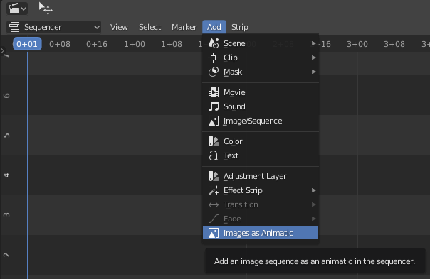
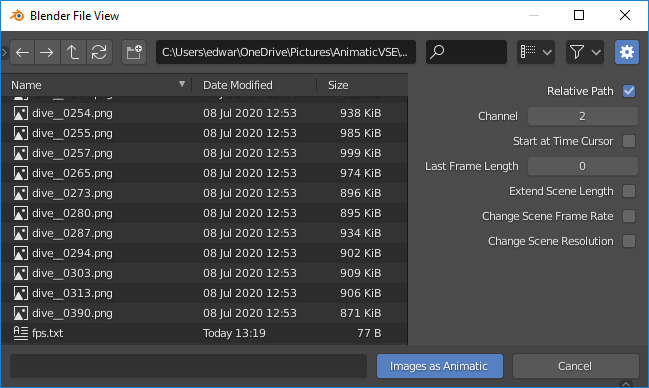
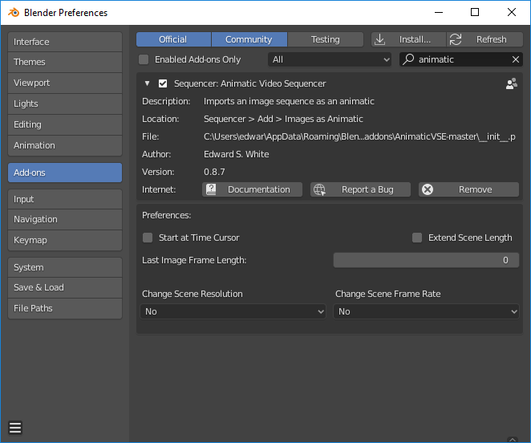

# Animatic Video Sequencer
Blender add-on for the Video Sequence Editor to import an image sequence as an animatic. It will import a directory full of images and place them in the timeline based on the filename numbers. Each image will be made visible until the next frame is reached in the timeline.

## Features
* Quickly add a directory of images to the Video Sequencer.
* Change scene frame rate by reading a text file loaded with the images. 
* Change scene resolution by reading a text file loaded with the images. 

## Requirements
* Blender 2.8 or higher

## Installation
In Blender's Edit menu, select "Preferences..." and then choose the Add-ons tab. Press the "Install..." button and select this zip file. Select the checkbox next to the Animatic Video Sequencer. 

## How to use
1. Select Video Editing when starting Blender or pick the Blender Video Editing workspace.
2. In the Video Sequencer window and the Add menu, select "Images as Animatic".
3. Choose a directory of images. (No need to select any files.) 
4. Press the button, "Images as Animatic".  
  

## Options
After the add-on is started from the Add menu, a Blender File View window will open. On the right side of the window there should be a panel of options. If they are not visible, press the gear icon in the upper right part of the window. Detailed descriptions for each setting are below.

## Relative Path
Relative Path is a normal Blender option that tells Blender how to look for files. It is recommended to leave it on. Blender can look for files relative to where the blend file is saved. This makes it easier to transport the blend file to another computer.
## Channel
Channel is a normal Blender option that tells Blender where to put the sequence of images. Channel 1 is typically reserved for audio. If a channel already has a sequence in it, The next higher channel will be used. Since each image loads in as a separate element, some elements may fit in channel 2, while others use channel 3 or the next higher available slot.
## Start at Time Cursor
When this option is on, a sequence will start at the time cursor. Normally, the image file name determines where the images get placed. An example file named, "picture_0001.png" will get placed at frame 1 and stay visible until the next file is found. If the first image is named, "picture_0012.png", it will get placed at frame 12. Turning on the option "Start at Time Cursor" and putting the time cursor at fram 100 will cause the frames to get added at that point as if it were the frame 1 position.
## Last Frame Length
The length of time that the last frame is visible, can be set to any positive number. By setting it to zero, it will set to be visible as an average time of all of the frames before it. If every frame before it stayed visible for 10 frames, then the last frame would stay visible for ten frames.
## Extend Scene Length
The scene end frame can be changed to increase if the series of images lasts longer than the current setting.
## Change Scene Frame Rate
This option will only work if there is an FPS.txt file in the same directory. See below for the specifics of the file.
## Change Scene Resolution
This option will only work if there is an FPS.txt file in the same directory. See below for the specifics of the file.

## FPS.txt File
A small file in the same directory as the images can be (optionally) used to change the scene frame rate and/or resolution. It needs to be named "FPS.txt" and it is not case sensitive. The text file needs three specific lines for it to work. The FPS: line will set the frame rate. The other two lines RES_X: and RES_Y: wil set the scene resolution. A sample file looks like the following:

    SCENE NAME: Scene
    FPS: 24
    RES_X: 1407
    RES_Y: 640

__NOTE__ The settings in the file will only be used if the options are selected at load time.

## Preferences
The import options can be preset in the add-on preferences. In Blender's Edit menu, select "Preferences..." and then type the word "animatic" (without quotes) in the search box. The Documentation button will link to this GitHub page. The "Report a Bug" button will link to the GitHub issues page for this add-on.

